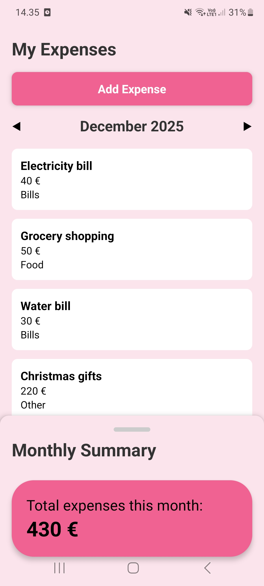
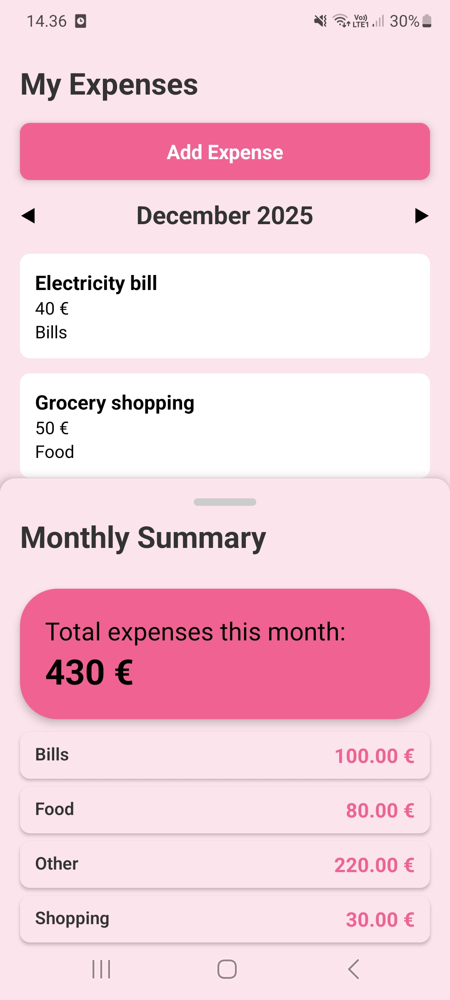
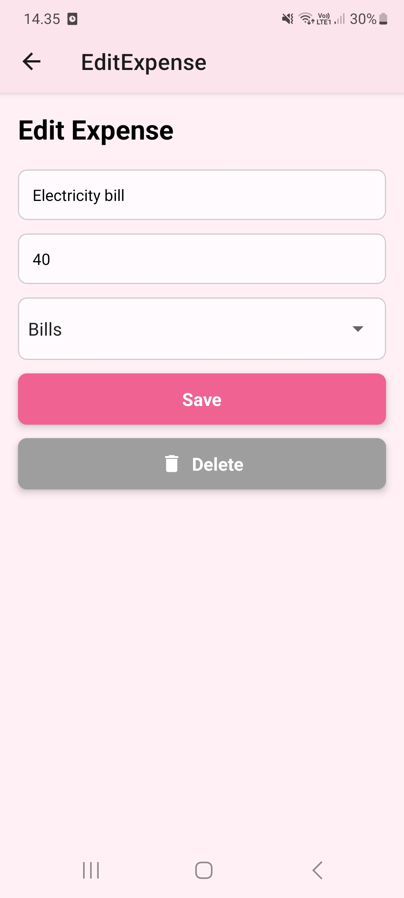

# Expense Tracker App

A simple React Native app built with **Expo** for tracking personal expenses. Users can add, edit, and delete expenses, view monthly totals, and see category-wise spending summaries.

---

## Screenshots

<div style="display: flex; gap: 10px;">




</div>

---

## Features

- Add, edit, and delete expenses
- View total expenses for the selected month
- See spending by category
- Swipe-up sheet for monthly summaries
- Select previous month to view past expenses

---

## Technologies

- **React Native** with Expo
- **Zustand** for state management
- **AsyncStorage** for persistent storage
- **React Navigation** for screen navigation
- **Animated API** and **PanResponder** for interactive UI

---

## Getting Started

### Prerequisites

- Node.js
- npm or yarn
- Expo Go app (for mobile testing) or emulator/simulator

### Installation

```bash
# Clone the repository
git clone https://github.com/tetuanka/ExpenseTracker.git
cd ExpenseTracker

# Install dependencies
npm install
# or
yarn install

# Start Expo
npx expo start
